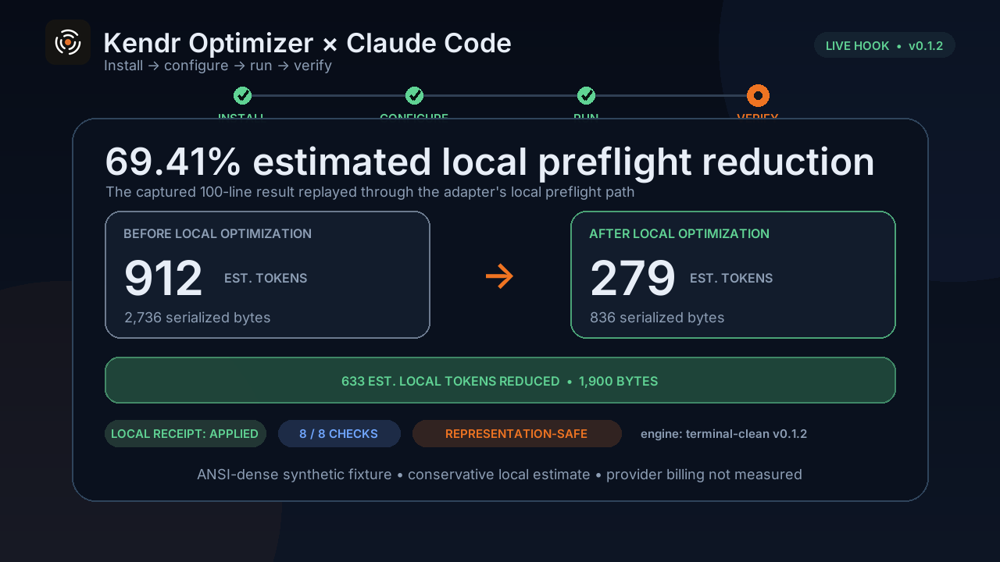

<p align="center">
  
</p>

# Kendr Optimizer

Provider-neutral token optimization for existing LLM CLIs and agent runtimes.

Status: pre-alpha (`0.1.2`). Kendr transforms supported prompt, context, and
tool-output surfaces locally. Your harness still owns provider credentials,
model selection, routing, streaming, and billing.

## Claude Code Demo

<p align="center">
  <a href="docs/assets/kendr-claude-code-demo.mp4">
    
  </a>
</p>

<p align="center">
  <a href="docs/assets/kendr-claude-code-demo.mp4">Watch the 60-second install → configure → run → verify walkthrough</a>
</p>

The walkthrough shows a current-source `0.1.2` installation, isolated setup,
the Claude Code launch command, and a live successful `PostToolUse` output
replacement. For the captured ANSI-heavy payload, Kendr's conservative local
preflight estimate moves from 912 to 279 tokens (69.41%). This is a
workload-specific local reduction, not provider-billed or whole-session
savings.

## Install

Install the CLI from the public GitHub Release. No Rust toolchain, repository
checkout, npm package publication, or provider key is required.

macOS or Linux:

```bash
curl --proto '=https' --tlsv1.2 -LsSf \
  https://github.com/Kendr-AI/Kendr-Optimizer/releases/download/v0.1.2/kendr-opt-installer.sh | sh
```

Windows PowerShell:

```powershell
irm https://github.com/Kendr-AI/Kendr-Optimizer/releases/download/v0.1.2/kendr-opt-installer.ps1 | iex
```

Then launch the LLM CLI you already use through Kendr:

```bash
kendr-opt run opencode
```

`kendr-opt run` installs Kendr's bundled adapter into the selected harness,
starts the local optimizer, launches the harness, and stops the optimizer when
the harness exits. It does not change the harness's provider or model settings.

See detected and supported harnesses:

```bash
kendr-opt setup --list
```

Configure every supported harness already installed on the machine without
launching one:

```bash
kendr-opt setup
```

The same GitHub Release also contains installable `.tgz` packages for the Node
adapters, a Hermes `.whl`, and the NanoClaw skill archive. Those assets are for
manual or managed deployment; normal users do not need npm or PyPI.

## Configure OpenCode

Keep OpenCode's existing provider configuration and run:

```bash
kendr-opt run opencode
```

Kendr installs a dependency-free plugin in OpenCode's global plugin directory.
It can optimize the current user message and tool output. Experimental history
and system hooks remain disabled by default.

## Configure Claude Code

Keep Claude Code's existing provider configuration and run:

```bash
kendr-opt run claude-code
```

This writes the repository-hosted plugin locally, starts its loopback hook
bridge, and launches Claude Code with the plugin. Node.js 22 or newer is
currently required for the bridge. Claude Code's stable hooks allow Kendr to
replace successful tool output; submitted prompts and assistant output are
observed only, and full history cannot be replaced.

The plugin is also available from this repository as a Claude marketplace for
managed installations:

```bash
claude plugin marketplace add Kendr-AI/Kendr-Optimizer
claude plugin install kendr-optimizer@kendr
```

## Configure Pi

Keep Pi's existing provider configuration and run:

```bash
kendr-opt run pi
```

Kendr installs a global Pi extension. It can optimize the system prompt,
context messages, and text-bearing tool results.

## Configure OpenClaw

Keep OpenClaw's existing gateway and provider configuration and run:

```bash
kendr-opt run openclaw
```

Kendr installs the local plugin through OpenClaw and selects it for the
exclusive `contextEngine` slot. If another context engine already owns that
slot, setup stops without replacing it. Review the conflict, then explicitly
replace it with:

```bash
kendr-opt run openclaw --force
```

## Configure Hermes Agent

Keep Hermes's existing provider configuration and run:

```bash
kendr-opt run hermes
```

Kendr installs and enables a user plugin for the main-agent request and tool
middleware. Auxiliary plugin-owned model calls and unsupported multimodal
content remain unchanged.

## Configure Another CLI

A CLI can use Kendr only when it exposes a hook or plugin API that can return
modified context before model dispatch, or modified tool output before it is
added to history. Provider base-URL settings alone are not enough.

OpenAI's coding CLI does not currently expose the required context-replacement
hook, so this repository does not claim that integration. NanoClaw still
requires the guarded skill shipped in the GitHub Release, and Claude Code
Channels is a source-side library integration rather than a standalone CLI
adapter.

Do not point `OPENAI_BASE_URL`, an Anthropic base URL, or any inference gateway
setting at Kendr. It is a local transformer, not an OpenAI- or
Anthropic-compatible provider proxy.

Detailed behavior and compatibility pins are in
[CLI and provider integration](docs/cli-provider-integration.md) and
[harness compatibility](docs/harness-compatibility.md).

Apache-2.0. See [LICENSE](LICENSE), [SECURITY.md](SECURITY.md), and
[CONTRIBUTING.md](CONTRIBUTING.md).
