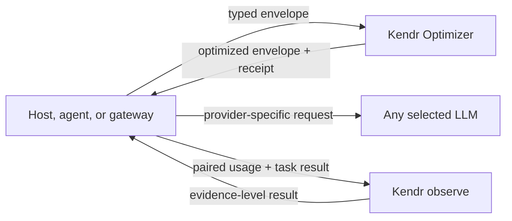

<p align="center">
  
</p>

# Kendr Optimizer

**Verification-Gated Typed Token Reduction for provider-neutral LLM contexts.**

Kendr Optimizer reduces the token surface of prompts, conversation history,
documents, tool definitions, and tool results. It is a transformer, not a
gateway: it never chooses a model, stores provider credentials, or forwards a
request to an LLM.

> Status: pre-alpha (`0.1.1`). The typed contract, safety controller, nine
> native engines, CLI, loopback transform service, seven audited harness
> integrations, reproducible rankings, and publication whitepaper exist.
> Provider-verified savings and broad downstream non-inferiority are not yet
> claimed.

Read the [technical whitepaper](docs/whitepaper.md) or the
[publication PDF](output/pdf/kendr-optimizer-verification-gated-token-reduction-whitepaper.pdf).

## What makes it different

Most token optimizers specialize in one layer: learned prompt pruning,
command-output filters, terse generation instructions, or gateway middleware.
Kendr implements a single provider-neutral transaction around independently
implemented native transforms:

```text
typed envelope
  -> validate
  -> propose candidate
  -> measure the complete serialized envelope
  -> verify structure, protocol, artifacts, cache, and risk
  -> apply only if signed net gain clears policy
  -> return optimized envelope + receipt + optional recovery
```

The key rule is simple:

> Reduce only what passes structure, integrity, cache, risk, and net-gain
> gates.

This is **Verification-Gated Typed Token Reduction**. "Verification-gated"
means executable invariants and byte-exact expansion for eligible typed
transforms. It does not claim formal proof or universal semantic equivalence.

## Product boundary



Kendr does not expose chat-completion routes, upstream-provider URLs, routing
rules, or provider-key storage. Peer packages used by the benchmark are not
runtime dependencies.

## Current evidence

The latest complete public experiment is
[`v0.1.0-benchmark.5`](releases/v0.1.0-benchmark.5/README.md). It executes a
pinned nine-case authored corpus and independently recounts visible payloads
with `tiktoken o200k_base 0.12.0`.

### What "qualified reduction" means

Prompt/context and command/tool-output are separate tracks. Raw reduction is a
signed, token-weighted aggregate over completed, scored cases:

```text
raw reduction = 100 * (sum(input tokens) - sum(output tokens)) / sum(input tokens)
```

The benchmark then applies a binary evidence gate. **Qualified reduction is the
same raw percentage, unchanged, when the gate passes.** It is `N/A` when the
gate fails; it is not a discounted score.

| Label | Exact meaning in this benchmark |
| --- | --- |
| Raw token reduction | Aggregate `o200k_base` token delta over completed, scored cases. Negative means token inflation. |
| Case passes composite fixture-preservation gate | Every fixture-declared required literal remains; JSON values are equal where JSON equivalence is required; and the exact benchmark query marker remains. |
| Qualified reduction | Raw reduction admitted to the primary table because every frozen case on that surface completed, failures are zero, and every completed case passed its composite fixture-preservation gate. |
| Excluded from primary ranking | The raw result remains visible for diagnosis, but qualified reduction is `N/A` because coverage or preservation failed. This does not claim the optimizer is universally unsafe. |

`5/5` means five completed cases passed the composite case-level gate, not five
individual invariant checks. URL, path, and number recall are reported as
diagnostics; they become hard requirements only when the fixture also declares
those exact values as required literals. This gate is deliberately stricter
than raw compression, but it is not a downstream LLM quality test.

### How release `.5` was tested

1. Freeze nine authored fixtures: five prompt/context cases and four
   command/tool-output cases, plus peer versions, settings, and runner sources.
2. Execute one pinned optimizer configuration on every case it supports and
   retain the complete input, output, status, stdout, stderr, and environment.
3. Independently recount each completed case's full visible input and output
   with `tiktoken o200k_base 0.12.0`; do not trust a peer's self-reported count.
4. Compute the signed aggregate raw reduction. Completed zero-delta cases stay
   in the token sums. Failed cases have no scored output, so they do not enter
   those sums; they remain in coverage accounting and block qualification.
5. Evaluate each completed case's composite fixture-preservation gate.
6. Admit the unchanged raw percentage as qualified only if eligible and
   completed counts equal the full surface (5/5 or 4/4), failures are zero, and
   every completed case passes. Otherwise publish `N/A`, the raw diagnostic,
   and the concrete coverage or proxy-pass counts.
7. Rank eligible rows by stored four-decimal qualified reduction, then fewer
   zero-token-delta cases. Exact ties share a competition rank. Latency never
   changes rank.

The release summary also records a narrower declared-scope qualification over
the cases a runner says it supports. The public ranking adds the full-surface
gate above. For example, a `1/1` declared-scope result is still excluded from a
five-case public track as `1/5` coverage.

### Primary qualified ranking

| Prompt/context rank | Optimizer configuration | Qualified reduction | Cases passing composite fixture gate |
| ---: | --- | ---: | ---: |
| 1 | Kendr Optimizer `default` | 71.64% | 5/5 |
| 2 | LLMLingua GPT-2 feasibility `target-50` | 64.44% | 5/5 |
| 3 | Headroom structural-only `target-50` | 38.57% | 5/5 |
| 4 | OmniRoute deterministic stack | 1.54% | 5/5 |
| 5 | Headroom structural-only `default` | 0.00% | 5/5 |

| Command/tool-output rank | Optimizer configuration | Qualified reduction | Cases passing composite fixture gate |
| ---: | --- | ---: | ---: |
| 1 of 1 | Kendr Optimizer `default` | 61.38% | 4/4 |

The `1 of 1` label matters. RTK reduced the command/tool payload 97.27 percent
raw and OmniRoute reduced it 71.45 percent raw, but the exercised settings
passed the composite fixture gate on 0/4 and 1/4 completed cases respectively.
Their qualified reduction is therefore `N/A`, and neither enters the primary
ranking. Those raw results remain visible for diagnosis.

This is not a universal "best optimizer" claim. The corpus is small and
project-authored; no target LLM ran, no provider bill was observed, and the
proxies do not establish downstream answer quality. Full inputs, outputs,
errors, environment, runner sources, peer locks, and checksums are retained.

See the generated
[ranking report](benchmarks/rankings/v0.1.0-benchmark.5/ranking.md),
[ranking JSON](benchmarks/rankings/v0.1.0-benchmark.5/ranking.json), and
[benchmark methodology](docs/benchmark-methodology.md).

## Local reduction is not provider-verified saving

Kendr keeps six evidence levels separate:

| Level | Evidence | Meaning |
| ---: | --- | --- |
| E0 | Byte delta | Serialized bytes changed |
| E1 | Local token delta | A declared tokenizer recount changed |
| E2 | Estimated cost delta | Local tokens mapped through price assumptions |
| E3 | Observed optimized usage | Provider usage exists for the optimized run |
| E4 | Paired observed delta | Baseline and optimized provider usage are paired |
| E5 | Quality-adjusted saving | Paired saving passes task-quality criteria |

An applied preflight result should be shown as:

```text
13 input tokens reduced (preflight, o200k_base).
Provider saving not yet verified.
```

For a zero local token delta, report "no local token reduction." For a negative
delta, report the measured token inflation explicitly. For a positive local
delta without a paired provider baseline, report the local reduction and
"provider saving not yet verified." Absence of E4 evidence must not erase a
real E1 reduction.

## Implemented surface

| Layer | Current implementation |
| --- | --- |
| Contract | Versioned `kendr.optimize/v1` request and `kendr.receipt/v1` receipt |
| Content | Roles plus typed text, code, JSON, document, image, tool-call, and tool-result parts |
| Measurement | Whole-envelope bytes, SHA-256, exact `cl100k_base` / `o200k_base`, or labeled approximation |
| Safety | Protocol immutability, typed exact-part checks, protected-artifact multiplicity, cache and risk gates, signed gain, and a best-effort pre-dispatch latency guard |
| Exact transforms | Independent marker expansion and byte-for-byte full-envelope comparison |
| Recovery | Digest-checked pre-alpha recovery capsule; privacy limitations documented |
| Interfaces | Rust library, JSON CLI, transform-only loopback service |
| Integrations | Claude Code, Claude Channels, Pi, OpenCode, Hermes Agent, OpenClaw, NanoClaw |
| Evidence | Immutable benchmark bundles plus derived, checksum-bound rankings |

## Quick start

### Install the CLI

The release installers download a native archive, verify its SHA-256 digest,
smoke-test the binary, and then install `kendr-opt`. No Rust toolchain is
required. The binaries are checksum-protected but are not yet OS code-signed.

macOS or Linux, when the repository/release is publicly accessible:

```bash
curl --proto '=https' --tlsv1.2 -LsSf \
  https://github.com/Kendr-AI/Kendr-Optimizer/releases/download/v0.1.1/kendr-opt-installer.sh | sh
```

Windows PowerShell, when the repository/release is publicly accessible:

```powershell
irm https://github.com/Kendr-AI/Kendr-Optimizer/releases/download/v0.1.1/kendr-opt-installer.ps1 | iex
```

For a private repository, authenticate GitHub CLI first with `gh auth login`,
then run one of these equivalent commands:

```bash
gh release download v0.1.1 -R Kendr-AI/Kendr-Optimizer \
  -p kendr-opt-installer.sh -O - | sh
```

```powershell
iex ((gh release download v0.1.1 -R Kendr-AI/Kendr-Optimizer `
  -p kendr-opt-installer.ps1 -O -) -join "`n")
```

The default install directory is `$HOME/.local/bin` on macOS/Linux and
`%LOCALAPPDATA%\Kendr\bin` on Windows. Set `KENDR_INSTALL_DIR` to override it.
The POSIX installer prints a PATH command when needed; the PowerShell installer
adds its directory to the user PATH unless `KENDR_NO_MODIFY_PATH=1`.

Supported release targets are Windows x64, Linux x64/ARM64, and macOS
Intel/Apple Silicon. Installers fail closed on unsupported platforms.

### Build from source

Source builds require Rust 1.88 or newer. Python 3.11 or newer is needed only
for benchmarks, ranking, release packaging, and documentation builds.

### Build and test

```bash
cargo build --workspace --locked
cargo test --workspace --locked
```

Install the CLI from this checkout:

```bash
cargo install --path crates/kendr-optimizer-cli --locked
kendr-opt engines
```

### Analyze or optimize

Analysis returns receipts without applying changed content:

```bash
kendr-opt analyze --input examples/request.json
```

Optimization returns the full validated envelope and receipt:

```bash
kendr-opt optimize --input examples/request.json
```

Other commands:

```bash
kendr-opt restore --input path/to/recovery.json
kendr-opt observe --input examples/observation-paired.json
kendr-opt engines
```

### Run the transform-only service

```bash
kendr-opt serve --bind 127.0.0.1:7331
```

Health and capabilities:

```bash
curl http://127.0.0.1:7331/healthz
curl http://127.0.0.1:7331/v1/capabilities
curl http://127.0.0.1:7331/v1/engines
```

Optimize an envelope:

```bash
curl -sS http://127.0.0.1:7331/v1/optimize \
  -H "content-type: application/json" \
  --data-binary @examples/request.json
```

The service has no built-in authentication, request-size limit, or concurrency
quota in pre-alpha. Keep it on loopback or place it behind a separately managed
security boundary.

## Request contract

The authoritative API is the normalized envelope, not an OpenAI- or
Anthropic-specific request body:

```json
{
  "schema_version": "kendr.optimize/v1",
  "phase": "request",
  "request_id": "demo-001",
  "content": {
    "messages": [
      {
        "id": "u1",
        "role": "user",
        "parts": [
          {
            "type": "text",
            "text": "Diagnose the build failure. Do not change the API."
          }
        ]
      }
    ],
    "tools": []
  },
  "target": {
    "tokenizer_profile": "o200k_base",
    "model": "optional accounting hint"
  },
  "host_capabilities": {
    "can_narrow_tools": false,
    "can_restore_references": false,
    "can_retry_with_full_tools": false,
    "streaming_output": true,
    "can_set_verbosity": true
  },
  "policy": {
    "risk_ceiling": "recoverable",
    "min_gain_tokens": 8,
    "min_gain_percent": 1,
    "latency_budget_ms": 25,
    "preserve_cache_prefix": true
  }
}
```

Provider-only and unknown host fields stay outside this envelope and must be
copied unchanged by the adapter.

## Risk model

| Risk | Meaning | Default |
| --- | --- | --- |
| Pass-through | Measurement only | Allowed |
| Representation-safe | Parsed value or rendering representation preserved | Allowed |
| Recoverable | Omitted representation has exact recovery | Allowed |
| Extractive | A relevance policy removes information | Disabled |
| Learned | A local model influences selection or rewriting | Planned, disabled |

Recovery is not automatically model-visible equivalence. Exact typed engines
receive a stronger check: their canonical markers must independently expand to
the byte-identical prior envelope.

## Native engines

The current controller runs a deterministic ordered portfolio:

| Order | Engine | Surface | Risk | Behavior |
| ---: | --- | --- | --- | --- |
| 1 | `json-minify` | Embedded JSON | Representation-safe | Parse and compact while preserving the JSON value |
| 2 | `terminal-clean` | Tool result | Representation-safe | Remove recognized ANSI presentation codes |
| 3 | `text-normalize` | Text/document | Representation-safe | Normalize conservative redundant blank space |
| 4 | `repeat-lines` | Tool result | Recoverable | Fold exact repeated lines with count and digest |
| 5 | `pytest-result-fold` | Pytest output | Recoverable | Fold validated consecutive success sequences |
| 6 | `context-repetition` | Text/document | Recoverable | Fold exact repeated blocks, paragraphs, lines, and sentences |
| 7 | `history-dedup` | History | Recoverable | Emit references only for hosts that can restore them |
| 8 | `tool-output-prune` | Large tool result | Extractive | Opt-in diagnostic extraction |
| 9 | `tool-selector` | Optional tools | Extractive | Opt-in removal with required-tool and retry gates |

Read [the algorithm specification](docs/algorithms.md) and
[architecture](docs/architecture.md) for implementation details.

## Harness compatibility

Compatibility means an adapter implements the seams actually exposed by the
pinned host version. It does not mean every field can be intercepted.

| Harness | Audited pin | Applied surface | Coverage boundary |
| --- | --- | --- | --- |
| Claude Code | 2.1.224 | Successful tool output | Prompt/history/tool catalog cannot be replaced through stable hooks |
| Claude Channels | Research preview in 2.1.224 | Authorized notification text | Source-side helper only |
| Pi | 0.84.1 | System, context messages, text tool results | No generic provider or tool-schema rewrite |
| OpenCode V1 | 1.18.15 | Current user text, tool output, opt-in experimental history/system | Tool schema and generation rewrite disabled |
| Hermes Agent | 0.20.0 / v2026.8.3 | Main-agent text, recognized tools, string tool results | Auxiliary calls and opaque multimodal parts excluded |
| OpenClaw | 2026.7.2 | Assembled history and supported tool results | Exclusive context-engine slot; initial prompt/schema limits |
| NanoClaw | Pinned unreleased main | Initial and follow-up formatted prompt strings | Guarded source customization; partial visibility |

All adapters use a credential-free numeric loopback endpoint, validate returned
shape, and preserve the original host value on timeout, invalid output, or
sidecar failure. See the full
[compatibility matrix](docs/harness-compatibility.md) and immutable
[pin ledger](integrations/harnesses.lock.json).

The repository root intentionally contains no development-assistant control
directories or instruction files. Optional integration directories may contain
the minimal install-time metadata a target harness requires; those artifacts
package the product adapter and do not direct development of this repository.

## Reproduce the ranking

Generate the derived ranking outside the immutable benchmark release:

```bash
python benchmarks/runners/rank_release.py \
  --release releases/v0.1.0-benchmark.5 \
  --output benchmarks/rankings/v0.1.0-benchmark.5
```

Verify byte-exact generated output and source checksums:

```bash
python benchmarks/runners/rank_release.py \
  --release releases/v0.1.0-benchmark.5 \
  --output benchmarks/rankings/v0.1.0-benchmark.5 \
  --check
```

The rank key is qualified reduction descending, then fewer completed cases with
zero token delta. Exact
ties share a standard competition rank. Latency is diagnostic only and never
changes rank. Baselines, unqualified raw reductions, generation-policy
experiments, and Kendr development profiles remain separate.

Run `python benchmarks/runners/execute_release.py --help` to inspect the full
peer-execution workflow. Model caches, virtual environments, and cloned peers
are local build inputs and are never part of the source archive.

## Build the whitepaper

The Markdown source is authoritative. The ReportLab builder inserts only the
explicit vector figures and publication layout:

```bash
python -m pip install -r scripts/requirements-docs.txt
python scripts/build_whitepaper.py
```

Output:

```text
output/pdf/kendr-optimizer-verification-gated-token-reduction-whitepaper.pdf
```

The PDF embeds the SHA-256 digest of its Markdown source. It builds
byte-for-byte deterministically within the same pinned ReportLab, Python, and
font environment; the builder records its selected font family in the PDF.

## Repository map

```text
crates/
  kendr-optimizer-contracts   Versioned Rust contracts
  kendr-optimizer-core        Network-free engines and controller
  kendr-optimizer-cli         CLI and transform-only HTTP service
spec/                         Language-neutral JSON schemas
integrations/                 Thin, version-pinned harness adapters
benchmarks/                   Corpus, peer runners, ranking builder
releases/                     Immutable evidence bundles
examples/                     Request and observation examples
docs/                         Architecture, algorithms, security, whitepaper
scripts/                      Documentation and repository-hygiene tools
output/pdf/                   Publication PDF
```

## Documentation

- [Whitepaper](docs/whitepaper.md)
- [Architecture](docs/architecture.md)
- [Native algorithms](docs/algorithms.md)
- [Measurement and receipts](docs/measurement.md)
- [Benchmark methodology](docs/benchmark-methodology.md)
- [Competitive landscape](docs/competitive-landscape.md)
- [Improvement analysis](docs/improvement-analysis.md)
- [Naming decision](docs/decisions/0002-name-and-method.md)
- [Harness compatibility](docs/harness-compatibility.md)
- [Threat model](docs/threat-model.md)
- [Provenance policy](docs/provenance.md)
- [Roadmap](docs/roadmap.md)

## Security

Prompts, tool traffic, cache topology, receipts, and recovery capsules can be
sensitive. The current recovery capsule may contain the complete original
envelope. Do not log it, share it across tenants, or retain it without an
explicit TTL.

Report vulnerabilities through a private GitHub security advisory. Read
[SECURITY.md](SECURITY.md) and the [threat model](docs/threat-model.md) before
deploying beyond local development.

## Contributing and governance

New engines must declare content scope, risk, cache behavior, resource bounds,
reconstruction semantics, provenance, and benchmark evidence. Raw compression
ratio alone is not an acceptance criterion.

- [Contributing](CONTRIBUTING.md)
- [Code of Conduct](CODE_OF_CONDUCT.md)
- [Governance](GOVERNANCE.md)
- [Support](SUPPORT.md)
- [Changelog](CHANGELOG.md)
- [Citation metadata](CITATION.cff)

## Package publication

The canonical source repository is
[`Kendr-AI/Kendr-Optimizer`](https://github.com/Kendr-AI/Kendr-Optimizer).
The `v0.1.1` GitHub pre-release publishes checksum-verified native CLI archives
and installers. They are not yet OS code-signed. Registry packages and
container images have not been published. Reserve and verify ownership of the
`@kendr` npm scope and crate/PyPI names before registry publication. Publish
Rust packages in dependency order: contracts, core, then CLI.

## License

Apache-2.0. Production code is independently implemented. Research influences,
software pins, and upstream licenses are recorded in
[the provenance policy](docs/provenance.md). Kendr does not copy peer optimizer
source into the production engine.
