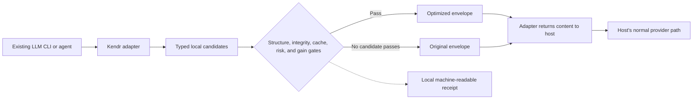

<p align="center">
  
</p>

# Kendr Optimizer

<p align="center">
  <strong>Reduce LLM-agent payloads locally—without changing providers or applying a candidate that fails Kendr's configured preservation gates.</strong>
</p>

<p align="center">
  <a href="https://github.com/Kendr-AI/Kendr-Optimizer/releases"></a>
  <a href="https://github.com/Kendr-AI/Kendr-Optimizer/actions/workflows/ci.yml"></a>
  <a href="LICENSE"></a>
  
</p>

Kendr Optimizer is an open-source, provider-neutral transformation engine for
LLM agent workloads. It reduces redundant prompt, context, and tool-output
payloads locally, then hands control back to the host that already owns the
model, credentials, routing, streaming, retries, and billing.

**Status:** pre-alpha (`0.1.2`) · **Core:** Rust · **License:** Apache-2.0

[Install](#install-in-two-commands) · [Watch the demo](#60-second-claude-code-demo) ·
[Inspect every benchmark row](#complete-preservation-gated-ranking) ·
[See every Kendr case](#kendr-case-by-case) ·
[Read the complete whitepaper](docs/whitepaper.md)

> [!NOTE]
> **Kendr.org deployment:** the optimizer is already configured for the
> [Kendr.org](https://kendr.org) product. The open-source CLI integrations below
> are separate local deployments and do not send provider credentials to
> Kendr.org.

## Published evidence at a glance

On the authored nine-case `v0.1.0-benchmark.5` payload benchmark, Kendr's
shipped `default` configuration ranked **#1 of 5 qualified prompt/context
configurations** and was the **only qualified command/tool-output configuration
among six executed optimizer configurations**.

| Surface | Published result | Tokens before → after | Qualified reduction | Fixture gate |
| --- | --- | ---: | ---: | ---: |
| Prompt and context | **#1 of 5 qualified configurations** | **6,358 → 1,803** | **71.64%** | **5/5 passed** |
| Command and tool output | **#1; only configuration to qualify** | **12,569 → 4,854** | **61.38%** | **4/4 passed** |

**Qualified** means the configuration covered the complete benchmark surface
with zero failures and every completed case passed its declared fixture gate.
That gate checks required literals, the exact query, and value-equivalent JSON
where the fixture declares it.
The benchmark scoring pass separately recounted tokens with
`tiktoken o200k_base 0.12.0` instead of trusting optimizer-reported estimates;
this was not a third-party audit.

> [!IMPORTANT]
> These are local payload measurements. The benchmark did not execute a target
> LLM or observe paired provider billing. It does not establish universal answer
> quality, provider cost savings, or a universal “best optimizer” claim.

[Read the complete ranking](benchmarks/rankings/v0.1.0-benchmark.5/ranking.md) ·
[Inspect the full peer report](releases/v0.1.0-benchmark.5/report.md) ·
[Open the immutable evidence bundle](releases/v0.1.0-benchmark.5/README.md)

The frozen bundle identifies the measured Kendr build as `0.1.0-dev`; `0.1.2`
is the current installable distribution. These figures are not relabeled as a
fresh `0.1.2` benchmark.

## Install in two commands

Install the native CLI from the public `v0.1.2` GitHub Release. You do not need
a Rust toolchain, source checkout, npm publication, PyPI publication, or a
Kendr-specific provider key; your harness keeps its existing authentication.

macOS or Linux:

```bash
curl --proto '=https' --tlsv1.2 -LsSf \
  https://github.com/Kendr-AI/Kendr-Optimizer/releases/download/v0.1.2/kendr-opt-installer.sh | sh
```

Windows PowerShell:

```powershell
irm https://github.com/Kendr-AI/Kendr-Optimizer/releases/download/v0.1.2/kendr-opt-installer.ps1 | iex
```

Then launch a supported LLM CLI through Kendr:

```bash
kendr-opt run claude-code
```

The Claude Code bridge currently requires Node.js 22 or newer. You can replace
`claude-code` with `opencode`, `pi`, `openclaw`, or `hermes`.

`kendr-opt run` installs Kendr's bundled adapter, starts the loopback optimizer,
launches the selected harness, and stops the service it started when the harness
exits. It does not change the harness's provider or model settings.

See support without changing files, or configure every supported harness
already detected on the machine without launching one:

```bash
kendr-opt setup --list
kendr-opt setup
```

Prefer to inspect before installing? Open the
[`v0.1.2` release](https://github.com/Kendr-AI/Kendr-Optimizer/releases/tag/v0.1.2)
for native archives, SHA-256 checksums, adapter packages, license notices, and
release notes.

## 60-second Claude Code demo

https://github.com/user-attachments/assets/73ad4f7b-3d5e-466f-97dd-6b93136440f4

<p align="center">
  <a href="docs/assets/kendr-claude-code-demo.mp4">Download the install → configure → run → verify walkthrough</a>
</p>

The walkthrough shows a current-source `0.1.2` installation, isolated setup,
the exact Claude Code launch command, and a live successful `PostToolUse`
replacement. Replaying the captured, deliberately ANSI-heavy tool result
through Kendr's conservative local preflight moves from 912 to 279 tokens
(**69.41%**). This is a workload-specific local estimate, not provider-billed
or whole-session savings.

## Why Kendr

- **Keep your existing stack.** Run Claude Code, OpenCode, Pi, OpenClaw, or
  Hermes through Kendr without replacing its provider or model configuration.
- **Optimize typed content, not arbitrary strings.** JSON, terminal output,
  repeated context, test output, history, and tool surfaces have different
  rules and different preservation boundaries.
- **Treat no-op as a valid result.** If no candidate passes the configured gates
  and positive-gain threshold, the original content continues unchanged.
- **Make every decision inspectable.** Applied, skipped, shadowed, and reverted
  outcomes carry machine-readable measurements, checks, and reasons.

## Supported integrations

| Harness | One-command launch | Applied surface | Important boundary |
| --- | --- | --- | --- |
| Claude Code | `kendr-opt run claude-code` | Successful tool output | Prompt and assistant output are observation-only; Node.js 22+ is currently required for the bridge |
| OpenCode | `kendr-opt run opencode` | Current user message and tool output | Experimental history and system hooks are off by default |
| Pi | `kendr-opt run pi` | System prompt, context messages, and text tool results | Tool narrowing and provider-payload rewriting are disabled |
| OpenClaw | `kendr-opt run openclaw` | Assembled history and supported message/tool-result text | `contextEngine` is an exclusive slot; replacement requires `--force` |
| Hermes Agent | `kendr-opt run hermes` | Main-agent request, instructions, recognized tools, and string tool results | Auxiliary plugin model calls and opaque multimodal content are unchanged |

Claude Code Channels is a source-side library integration. NanoClaw uses the
guarded skill shipped in the GitHub Release because it does not expose stable
middleware. As last audited on 2026-08-07, OpenAI's coding CLI did not expose
the pre-dispatch replacement hook Kendr requires, so this repository does not
claim that integration.

Pass harness arguments after `--`:

```bash
kendr-opt run opencode -- --model anthropic/claude-sonnet-4
kendr-opt run claude-code -- --resume
```

[Read the complete integration guide](docs/cli-provider-integration.md) ·
[Check audited compatibility pins](docs/harness-compatibility.md)

## How Kendr works



The pre-alpha implementation ships nine native engines, a Rust library and
CLI, a transform-only loopback service, recovery data where policy permits it,
and machine-readable receipts. It supports exact `cl100k_base` and
`o200k_base` BPE measurement over Kendr's normalized serialized envelope—not
the provider's final serialization or bill.

A candidate applies only after the relevant structural, protocol,
protected-artifact, cache, reconstruction, risk, and signed-gain checks pass.
For eligible typed transforms, reconstruction can be checked byte-for-byte.
Every automatic adapter falls back to the original host value on timeout,
service failure, malformed output, or structural mismatch.

Kendr is a transformer, not a provider proxy. Do not point `OPENAI_BASE_URL`,
an Anthropic base URL, or another inference gateway setting at it.

## Complete preservation-gated ranking

### Prompt/context qualified ranking

| Rank | Optimizer / setting | Tokens before → after | Qualified reduction | Coverage | Fixture gate |
| ---: | --- | ---: | ---: | ---: | ---: |
| **1** | **Kendr Optimizer — `default`** | **6,358 → 1,803** | **71.64%** | **5/5** | **5/5** |
| 2 | LLMLingua GPT-2 feasibility — `target-50` | 6,358 → 2,261 | 64.44% | 5/5 | 5/5 |
| 3 | Headroom structural-only — `structural-target-50` | 6,358 → 3,906 | 38.57% | 5/5 | 5/5 |
| 4 | OmniRoute deterministic stack — `rtk-standard+caveman-full` | 6,358 → 6,260 | 1.54% | 5/5 | 5/5 |
| 5 | Headroom structural-only — `structural-default` | 6,358 → 6,358 | 0.00% | 5/5 | 5/5 |

The LLMLingua and LongLLMLingua rows use a noncanonical GPT-2 feasibility
substitution. Configured `target-50` arms request an operating point; they do
not show an optimizer discovering the ideal reduction automatically.

<details>
<summary><strong>Executed prompt/context rows not assigned a public rank</strong></summary>

| Optimizer / setting | Raw reduction | Full-surface coverage | Fixture gate | Why unranked |
| --- | ---: | ---: | ---: | --- |
| Headroom Kompress + structural — `kompress-target-50` | 60.03% | 5/5 | 3/5 | Preservation gate failed |
| LongLLMLingua GPT-2 feasibility — `target-50` | 48.89% | 1/5 | 1/1 completed | Full-surface coverage failed |
| LLMLingua-2 small — `target-50` | 43.10% | 5/5 | 0/5 | Preservation gate failed |
| Unoptimized pass-through — `none` | 0.00% | 5/5 | 5/5 | Baseline, not a competitor |

</details>

### Command/tool-output results

| Ranking status | Optimizer / setting | Tokens before → after | Raw reduction | Coverage | Fixture gate |
| --- | --- | ---: | ---: | ---: | ---: |
| **#1 qualified** | **Kendr Optimizer — `default`** | **12,569 → 4,854** | **61.38%** | **4/4** | **4/4** |
| Unranked | RTK — documented filter per fixture | 12,569 → 343 | 97.27% | 4/4 | 0/4 |
| Unranked | OmniRoute deterministic stack | 12,569 → 3,588 | 71.45% | 4/4 | 1/4 |
| Unranked | Headroom Kompress + structural | 12,569 → 9,857 | 21.58% | 4/4 | 2/4 |
| Unranked | Headroom structural-only — `structural-default` | 12,569 → 10,400 | 17.26% | 4/4 | 3/4 |
| Unranked | Headroom structural-only — `structural-target-50` | 12,569 → 10,400 | 17.26% | 4/4 | 3/4 |
| Baseline | Unoptimized pass-through — `none` | 12,569 → 12,569 | 0.00% | 4/4 | 4/4 |

Higher raw deletion does not earn a rank when a required literal, exact query,
or declared structure is lost. That is why RTK's 97.27% and OmniRoute's 71.45%
tool-output reductions remain visible but unranked in this release. Prompt
compressors are not assigned synthetic scores on the tool-output surface.

[Review the ranking rules and every diagnostic row](benchmarks/rankings/v0.1.0-benchmark.5/ranking.md)

## Kendr, case by case

Every Kendr `default` case completed and passed its declared fixture gate.
Counts below come from the benchmark scoring pass and represent payload tokens,
not provider-billed usage.

| Case | Surface | Tokens before → after | Tokens removed | Reduction | Fixture gate |
| --- | --- | ---: | ---: | ---: | ---: |
| Short request (`short-exact-noop`) | Prompt/context | 29 → 29 | 0 | 0.00% | Pass |
| Redundant prose (`redundant-prose`) | Prompt/context | 1,200 → 64 | 1,136 | 94.67% | Pass |
| Retrieved documents (`rag-incident`) | Prompt/context | 1,843 → 755 | 1,088 | 59.03% | Pass |
| Pretty JSON (`pretty-json`) | Tool output | 3,226 → 1,905 | 1,321 | 40.95% | Pass |
| Terminal output (`repetitive-terminal-log`) | Tool output | 4,591 → 258 | 4,333 | 94.38% | Pass |
| Pytest output (`pytest-output`) | Tool output | 2,315 → 254 | 2,061 | 89.03% | Pass |
| Git log (`git-log`) | Tool output | 2,437 → 2,437 | 0 | 0.00% | Pass |
| Code context (`code-context`) | Prompt/context | 1,735 → 860 | 875 | 50.43% | Pass |
| Multilingual repeated context (`multilingual-constraints`) | Prompt/context | 1,551 → 95 | 1,456 | 93.87% | Pass |

The two no-ops are part of the result, not hidden failures. Kendr left a short
unique request and a unique Git history unchanged rather than delete
model-visible information to improve the percentage.

[Inspect the complete raw Kendr run](releases/v0.1.0-benchmark.5/runs/kendr-default.json)

## What we are optimizing next

Kendr is pre-alpha, and this repository is the public record of its progress.
We will keep publishing new typed engines, broader integrations, and immutable
benchmark revisions as we improve token use and measure the wider system:

- typed reducers for Git, build, diff, diagnostic, table, and additional test
  output;
- cache effects, optimizer latency, retries, and correction turns;
- randomized paired target-model trials with task-success scoring;
- end-to-end provider usage separated into uncached input, cache reads, cache
  writes, output, reasoning, and pricing revisions; and
- current compatibility pins and fail-open tests for every supported harness.

The goal is not a one-off percentage. Every benchmark update will keep frozen
inputs, raw outputs, no-ops, failures, regressions, environment metadata, and
checksums visible beside the improvements.

[Follow the evidence-gated roadmap](docs/roadmap.md)

Concrete ways to extend the project include:

- adding a typed reducer together with preservation fixtures;
- adding a harness adapter together with fail-open contract tests;
- contributing a reproducible workload to the benchmark corpus; or
- improving paired task-quality, latency, cache, and provider-usage measurement.

See [CONTRIBUTING.md](CONTRIBUTING.md) and [GOVERNANCE.md](GOVERNANCE.md) for the
project's evidence and review expectations.

## Read the complete work

- **[Technical whitepaper](docs/whitepaper.md):** the authoritative method,
  contracts, safety model, ranking rules, results, and claim boundaries.
- **[Whitepaper PDF](output/pdf/kendr-optimizer-verification-gated-token-reduction-whitepaper.pdf):**
  the publication-formatted copy bound to the Markdown source digest.
- **[Benchmark evidence](releases/v0.1.0-benchmark.5/README.md):** raw runs, logs,
  environment, checksums, corpus, and reproduction bundle.
- **[Integration guide](docs/cli-provider-integration.md):** installation,
  adapter behavior, provider ownership, and manual package deployment.
- **[Evidence-gated roadmap](docs/roadmap.md):** planned work beyond local token
  reduction.

<details>
<summary><strong>More technical references</strong></summary>

- [Full preservation-gated ranking](benchmarks/rankings/v0.1.0-benchmark.5/ranking.md)
- [Peer benchmark report](releases/v0.1.0-benchmark.5/report.md)
- [Benchmark methodology](docs/benchmark-methodology.md)
- [Architecture and current security limits](docs/architecture.md)
- [Audited harness compatibility pins](docs/harness-compatibility.md)
- [Security policy](SECURITY.md)
- [Support](SUPPORT.md)

</details>

The whitepaper describes the core `0.1.0` method and
`v0.1.0-benchmark.5` evidence. The installable CLI is currently `0.1.2`.

## Project status

Kendr Optimizer is pre-alpha. Contracts and integration pins can change before
a stable release. Keep the transform service on loopback, begin with shadow or
controlled workloads, and review [SECURITY.md](SECURITY.md) before broader use.

The repository is designed to be inspected, reproduced, and extended. New
engines, adapters, workloads, and measurements should preserve the same
evidence and fail-open standards.

Apache-2.0. See [LICENSE](LICENSE), [NOTICE](NOTICE), and
[SUPPORT.md](SUPPORT.md).
